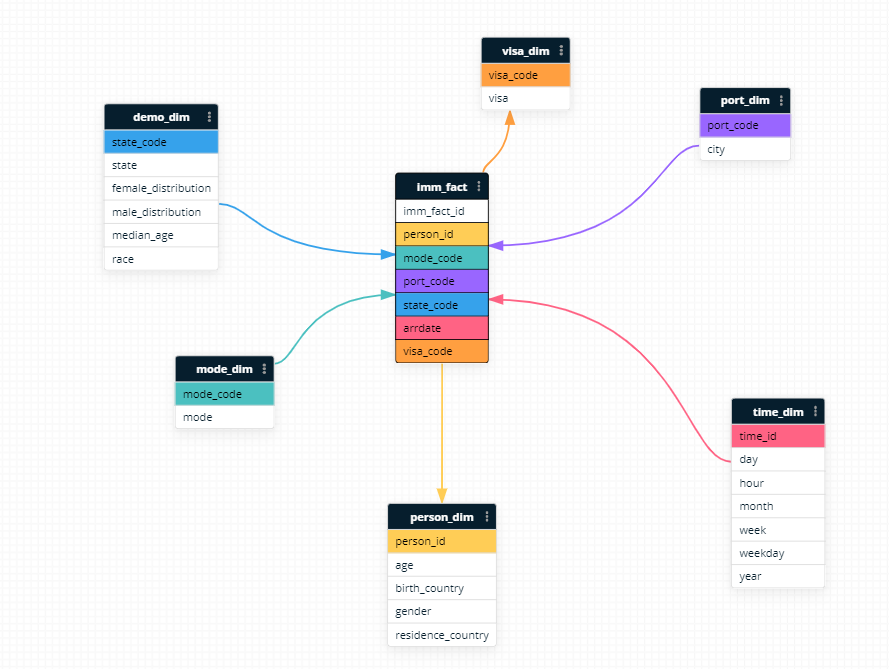
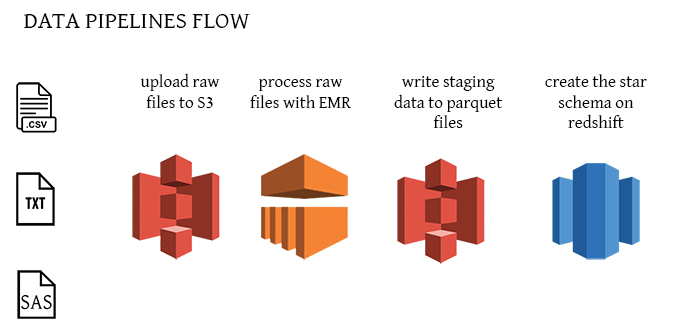
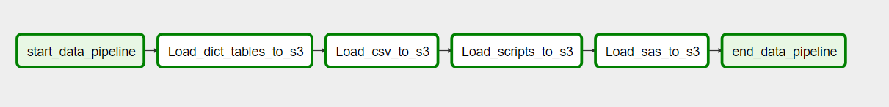
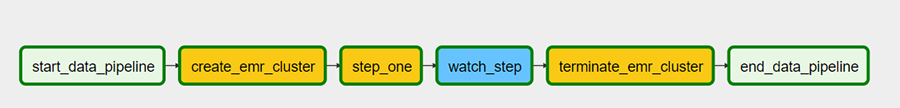
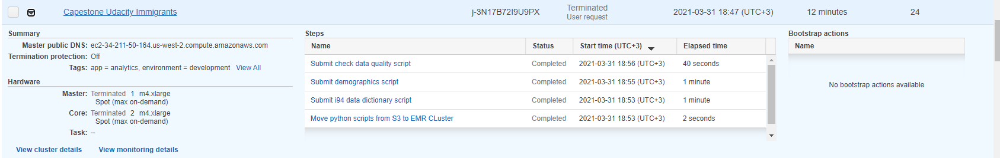
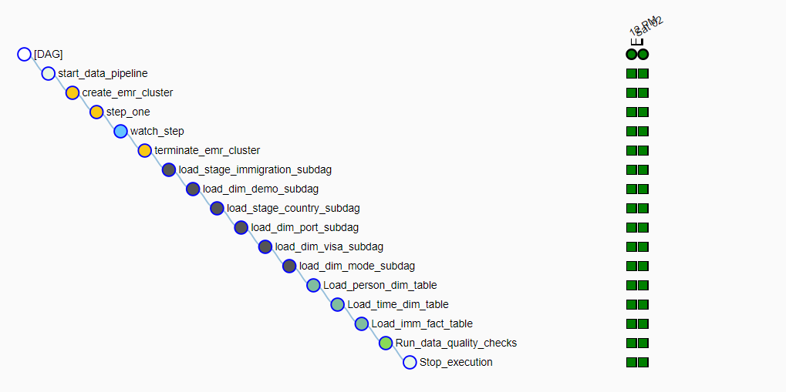

# Summary of the project, how to run the Python scripts, and an explanation of the files in the repository


This project is an example of building data pipelines for a data lake which we host on S3. 
We transform the raw data using Pyspark on Aws EMR and write parquet files to S3.
From S3 where we writed the staging tables we load the data to redshift in the dimensionial and fact tables to create a Star Schema.
Using this Star Schema we can continue finding insights and understand who are the immigrants who arrived in US States in the year 2016.

## Prerequisites

1. [docker](https://docs.docker.com/get-docker/) (make sure to have docker-compose as well).
2. [git](https://git-scm.com/book/en/v2/Getting-Started-Installing-Git) to clone the starter repo.
3. [AWS account](https://aws.amazon.com/) to set up required cloud services.
4. [Install](https://docs.aws.amazon.com/cli/latest/userguide/install-cliv2.html) and [configure](https://docs.aws.amazon.com/cli/latest/userguide/cli-configure-quickstart.html#cli-configure-quickstart-config) AWS CLI on your machine.

## AWS config

1. create a redshift cluster in the us-west-2 region, an IAM role and open incoming TCP port to access the cluster endpoint
2. configure an aws default connection using the aws credentials for an IAM ROLE with AdministratorAccess and S3FullAccess
3. In apache airflow be sure you use `aws_default` and `redshift` connections when you run the dags in the apache airflow
4. make sure to check for presence of the `EMR_EC2_DefaultRole` and `EMR_DefaultRole`
5. Modify the init.cfg file which sits in the ./dags folder and complete with the name of your buckets for bucket_name and bucket_logs. Be sure your bucket `bucket_name` is empty
6. For EC2 generate EC2 Key pair and add the name of your pair to ec2_key_name variable in the init.cfg (example: capestone)

## Design



## Data

Download the directory 'data' from the link below in the root folder of the project

```
https://drive.google.com/drive/folders/1pZ9N5shPUfsXPyIpr0J7OmThbuKqTQCw?usp=sharing
```

## Open local docker instance

```bash
docker-compose -f docker-compose-LocalExecutor.yml up -d


```

## DAGS

go to [http://localhost:8080/admin/](http://localhost:8080/admin/) to access the airflow interface

Throughout this project I implemented the core concepts of Apache Airflow: DAGS, Subdags, custom operators 
to perform different tasks such as staging the data, 
filling the data warehouse, and running checks on the data as a final step



The order we execute the dags: 

1. upload_dag - In the upload dag I make use of the custom LoadToS3Operator to upload local data to S3
   The raw data I upload are:
        - data dictionary files - I sliced the data from i94_SAS_LAbels_Description.SAS in 4 txt files
        - csv files
        - script files - py script files I submit to pyspark
        - sas7bdat files - just apr file is enough.
   
    
2. process_dag - I used EmrCreateJobFlowOperator to create an EMR cluster and submit spark scripts
   for the demographics and dictionary tables. The purpose is to clean, transform and write the data to parquet files 
   for the staging tables `state`, `country`, `port-dict`, `mode`, `visa`, `demographics`
   
   
   
3. dwh_dag - Is scheduled daily by setting start_date and end_date. This dag is projected to collect the data
   for each day from the sas files, clean, transform and write the immigration data  
   to S3 using the EMR cluster. 
   For every iteration of the `dag` the data in S3 is changed with the correspondent data for the execution_date.
   In the second half of the dag I created a subdag which call the custom operators: LoadToRedshiftOperator and HasRows which check if the 
   data was copied with success. 
        - In LoadToRedshiftOperator I used the COPY command to move the data in the redshift tables: 
   demo_dim, country_stage, port_dim, visa_dim, mode_dim.
        - FillTablesOperator - I'm using the data stored in imm_stage table to fill the dimensional tables person_dim, time_dim and imm_fact
          using SELECT INSERT INTO statements. In this operator I added the append only approach for the iterations where execution_date is greater
          than start_date. For the first iteration I drop and create the tables first before insert the data.
   
   
   


## Terminate local instance

```bash
docker-compose -f docker-compose-LocalExecutor.yml down
```

Do not forget to close the redshift cluster(everytime) or AWS EMR clusters if the dag didn't executed with success

## Addressing Other Scenarios
    - The data was increased 100x - I'm increasing the number of machines for the EMR cluster and run the airflow with Kubernetes or Amazon Managed Workflows for Apache Airflow (MWAA)
    - The pipelines would be run on a daily by 7 am every day - the pipline it's already made to extract the data daily, but I can improve the data quality tests.
    - The database needed to be accessed by 100+ people - I increase the number of nodes for the number of AWS Redshift Database

## A data dictionary for the final data model

```
SELECT b.age,
       b.birth_country,
       b.gender,
       b.residence_country,
       a.person_id,
       a.state_code,
       d.state,
       d.female_distribution,
       d.male_distribution,
       d.median_age,
       d.race,
       a.mode_code,
       e.mode,
       a.port_code,
       f.city,
       a.arrdate,
       t.day,
       t.hour,
       t.month,
       t.week,
       t.weekday,
       t.year,
       a.visa_code,
       v.visa
                FROM imm_fact a
LEFT JOIN person_dim b ON a.person_id=b.person_id
LEFT JOIN demo_dim d ON a.state_code=d.state_code
LEFT JOIN mode_dim e ON a.mode_code=e.mode_code
LEFT JOIN port_dim f ON a.port_code=f.port_code
LEFT JOIN time_dim t ON a.arrdate=t.time_id
LEFT JOIN visa_dim v ON a.visa_code=v.visa_code
LIMIT 1;
[{age:63, birth_country:'Albania', gender:'M', residence_country:'Albania', person_id:2017881282, state_code:'NJ', 
state:'New Jersey', female_distribution:'50.61%', male_distribution':49.39%', median_age:35, race:'White', mode_code:1, mode:'Air', 
port_code:'NYC', city:'New York', time_id:20545, day:1, hour:5, month:4, week:13, weekday:'Friday', year:2016, visa_code:2, visa:'Pleasure'}]
```
